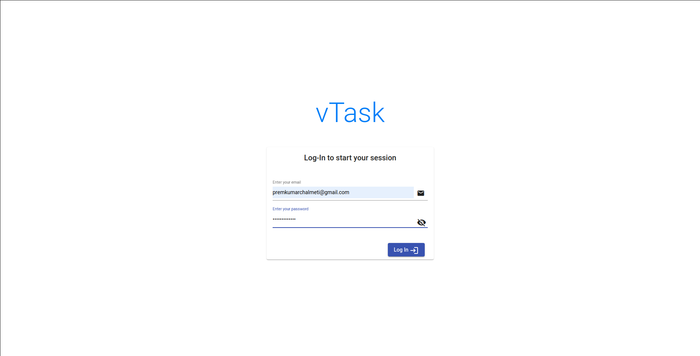
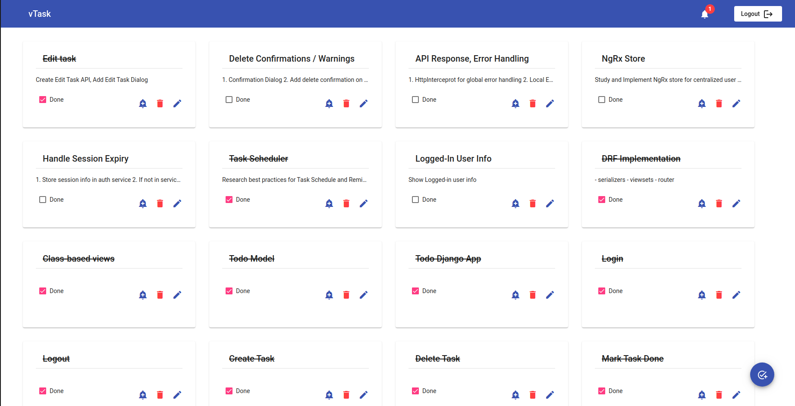
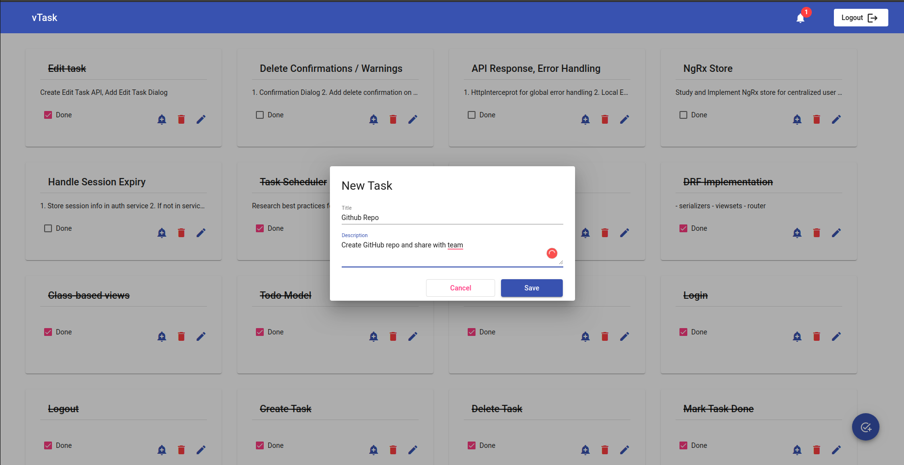
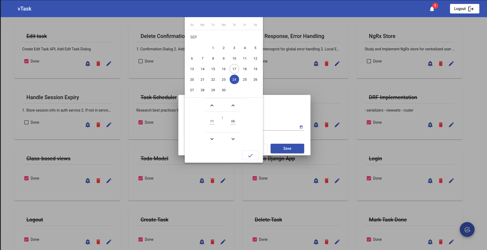
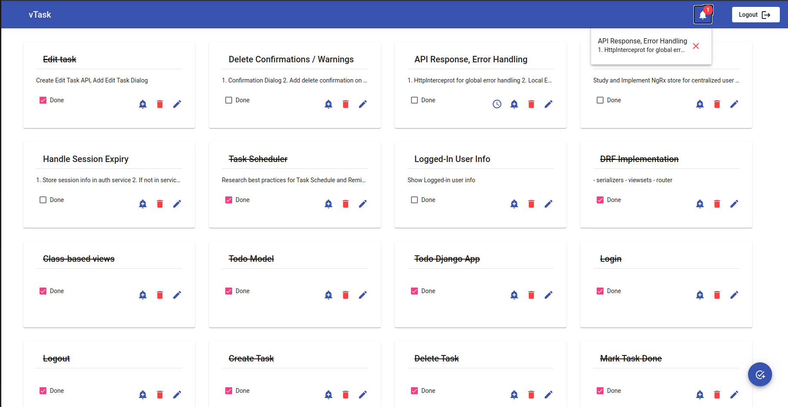

# Task Management App

## Login

## Dashboard

## New Task

## Set Reminder

## Reminders

### Steps to setup:

Clone Repo:

git clone git@github.com:premkumar30/vetodo.git

[Optional but recommended] create virtual environment

python3 -m venv envtodo

source envtodo/bin/activate

Specify database credentials

mkdir conf

touch conf/db.cnf

add your credentials in db.cnf file as,

[client]                                                                                                                                                               
database = vetodo_db

user = user

password = 'password'

default-character-set = utf8

Migrate database

python manage.py makemigrations

python manage.py migrate

Start servers

python manager.py runserver 8000

start redis-server (refer doc: https://redis.io/topics/quickstart)

python manage.py rqworker reminders_q

python manage.py rqscheduler reminders_q

Setup frontend

cd angularapp

npm install

ng serve

